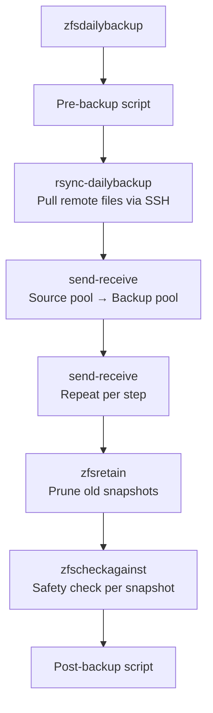
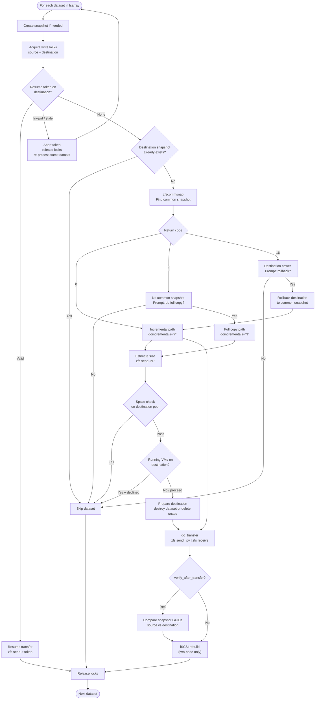
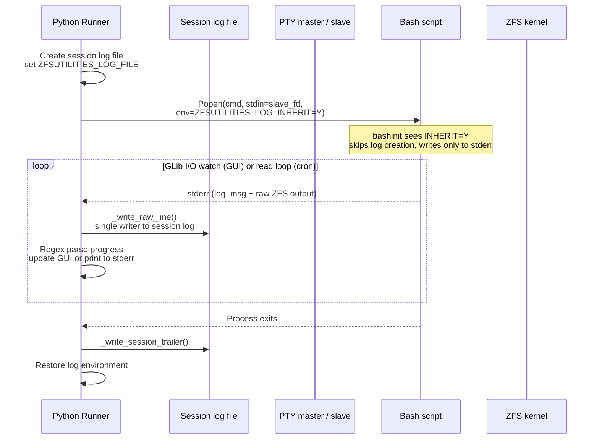
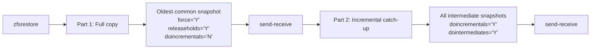
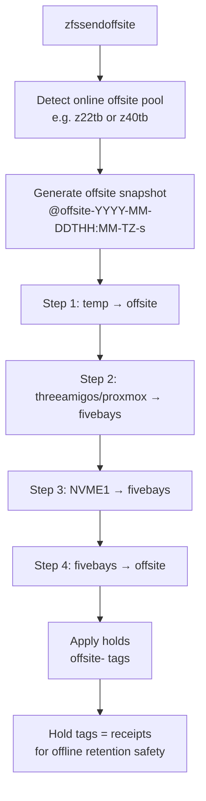
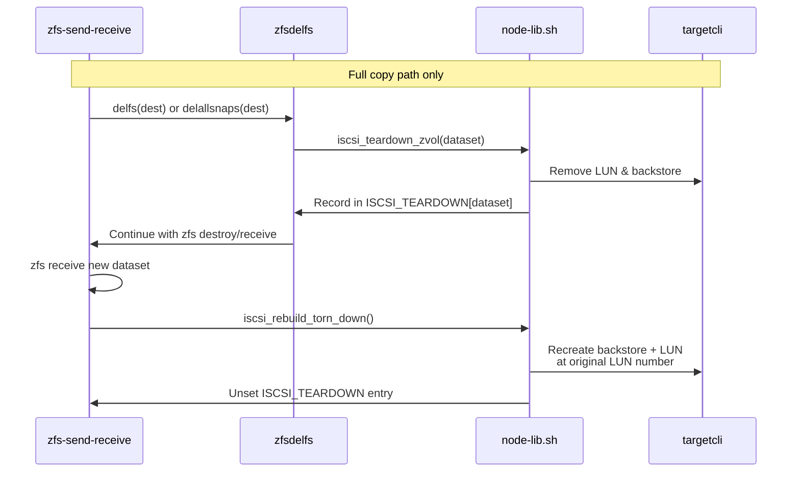

# Architecture

## Script Sourcing Pattern

All bash scripts follow this initialization pattern:

```bash
source ~/bashinit
bashinit
source $mydir/rootcheck
rootcheck
```

- `bashinit` sets `$mydir` to the calling script's directory
- [rootcheck](../commands-and-modules/modules.md#rootcheck) verifies the script is running as root
- Function scripts are **sourced**, not executed — their functions persist in the
  calling shell's environment

Because scripts are sourced, **any global variables set inside them persist**
after the function returns. This is intentional: it allows caller scripts to
read output variables like `fsarray` (the list of datasets built by
[`zfsbuildfsarray`](../commands-and-modules/modules.md#zfsbuildfsarray)).

### Session logging

`bashinit` auto-creates a session log file for scripts that are executed
directly (`calledbybash` returns true). It generates a filename like
`YYYY-MM-DD_HH-MM-SS_cli_<scriptname>.log` in
`/var/log/zfsutilities/sessions/` and exports it as
`ZFSUTILITIES_LOG_FILE`. Bash `log_msg` appends to this file when the
variable is set.

Both the GTK GUI (`BackupRunner`) and scheduled cron runs
(`profile_runner.py`) create a session log file and act as the **single writer**
for that log. Bash subprocesses receive `ZFSUTILITIES_LOG_INHERIT=Y` via their
environment. `bashinit` sees that flag and skips creating its own session log,
writing only to stderr. The Python runner reads raw stdout/stderr from the
subprocess pipes and writes every line to the session log file with a timestamp
prefix. This prevents duplicate lines and ensures that raw output (dataset
lists, `zfs receive` progress, separator lines, etc.) is preserved alongside
`log_msg` output.

- In `backup_runner.py`, `prepare_session_log()` creates the session file and
  uses `logging_config.session_log_context()` to set/restore
  `ZFSUTILITIES_LOG_FILE` and `ZFSUTILITIES_LOG_INHERIT`. The inherit flag is
  passed to the **subprocess environment** only so the bash script does not
  create a competing log. Python `log_msg` calls made by the runner itself
  always write to the session log file; the `ZFSUTILITIES_LOG_INHERIT` flag is
  not checked by Python code.
- In `profile_runner.py`, `_run_command()` prints subprocess output to stderr
  for display and appends it raw to the session log via `_write_raw_line()`.
  Python `log_msg` calls made by the runner itself (e.g. "Running profile:")
  write to the file because `ZFSUTILITIES_LOG_FILE` is set.

| Context                  | Auto-set? | Notes                                                                                                                                              |
| ------------------------ | --------- | -------------------------------------------------------------------------------------------------------------------------------------------------- |
| Direct CLI execution     | **Yes**   | `bashinit` creates the log and exports the variable                                                                                                |
| GUI runs                 | **Yes**   | `BackupRunner.prepare_session_log()` creates the log; `ZFSUTILITIES_LOG_INHERIT=Y` prevents bash subprocesses from creating competing logs         |
| Scheduled cron runs      | **Yes**   | `profile_runner.py` creates the log and sets `os.environ` before dispatching                                                                       |
| Sourced function scripts | **No**    | They inherit the variable from the parent script that sourced them                                                                                 |

If you need to capture output from a manually-run bash command, set the
variable yourself before invoking the script:

```bash
export ZFSUTILITIES_LOG_FILE="/var/log/zfsutilities/sessions/manual.log"
./zfs-send-receive
```

### Session log size cap

To prevent a runaway subprocess from filling disk, the Python runners enforce a
size cap on the session log file they own. When a log grows beyond
**1 GB**, it is rewritten as:

- the first **64 KB** (opening context),
- a marker line indicating how many bytes were omitted,
- the last **100 MB** (recent tail).

`backup_runner.py` checks the file size every 5 seconds via its process polling
timer; `profile_runner.py` checks every 5 seconds while reading subprocess
output and once more after the profile finishes. Because inherited bash
subprocesses write to the same file, the cap also bounds their output. After
truncation, the persistent index entry for that log is removed so the Logs tab
rescans the smaller file.

### Persistent log index

The Logs tab uses `07 GTK + Python/log_index.py` to avoid re-reading every
historical session log on startup or refresh. The index is a JSON file at
`/var/log/zfsutilities/sessions/.log_index.json` that stores, per log file:

| Field               | Purpose                                                            |
| ------------------- | ------------------------------------------------------------------ |
| `size`              | Last-known file size in bytes                                      |
| `mtime`             | Last-known modification time                                       |
| `status`            | `Done`, `Failed`, `Cancelled`, or `Running` from the trailer       |
| `duration`          | Elapsed seconds from the trailer                                   |
| `bytes_transferred` | Bytes transferred from the trailer (ZFS send/receive steps)        |
| `highest_level`     | Highest `log_msg` level seen (`DEBUG`, `VERB`, `INFO`, `WARN`, `FATAL`) |
| `has_trailer`       | Whether the trailer has been parsed                                |

`BackupRunner._write_session_trailer()` and `profile_runner._write_session_trailer()`
update the index with the final status, duration, and bytes after writing the
trailer. `logs_page._scan_logs()` creates or incrementally updates entries for
any log without an up-to-date index record, removes entries for deleted files,
and saves the index. `logs_page._tail_log_file()` also updates the index
incrementally while a running log is being viewed.

The index is advisory: if it is missing or corrupt, the Logs tab falls back to
scanning the log files directly and rebuilds the index.

## Core Components

### [zfs-send-receive](../commands-and-modules/modules.md#zfs-send-receive)

The main workhorse. Key parameters (all global variables):

| Variable           | Type    | Purpose                                                  |
| ------------------ | ------- | -------------------------------------------------------- |
| `$sourcefs`        | string  | Source dataset                                           |
| `$destfs`          | string  | Destination pool/dataset                                 |
| `$doincrementals`  | `Y`/`N` | Attempt incremental transfers                            |
| `$dointermediates` | `Y`/`N` | Include intermediate snapshots                           |
| `$includes`        | array   | Dataset name substrings to include                       |
| `$excludes`        | array   | Dataset name substrings to exclude                       |
| `$autoproceed`     | `Y`/`N` | Suppress interactive prompts                             |
| `$nextsnap`        | string  | Snapshot name to create                                  |
| `$force`           | `Y`/`N` | Force a full copy even if an incremental copy would work |

### [zfsbuildfsarray](../commands-and-modules/modules.md#zfsbuildfsarray)

Builds a filtered list of datasets into `$fsarray`. Respects:

- `$depth` — limit recursion depth. "0" means only the dataset itself. Null means unlimited.
- `$bottomup` — `'Y'` for descending sort
- `$includes` — array of dataset substrings to include (prefix `"="` for exact match from the beginning of the dataset name). If specified, only the matching dataset names are included. If not specified, all otherwise qualified datasets are included.
- `$excludes` — array of dataset substrings to exclude (prefix `"="` for exact match from the beginning of the dataset name). If not specified, no otherwise qualified datasets are excluded.
- `$startwith` — skip datasets before this substring match. If no otherwise qualified datasets are found, the script will abort.
- `$endwith` — skip datasets after this substring match. If no otherwise qualified datasets are found, the script will abort.

The parameters are processed in the order given above.

### [zfsretain](../commands-and-modules/modules.md#zfsretain)

Applies retention policies in three phases:

1. For `@offsite` snapshots, remove all but the most recent per month per dataset
2. Remove same-day duplicate snapshots within each bucket
3. Prune by bucket retention counts ("policies")

Snapshots with label `clone` or bucket `c` are skipped entirely—they are never deleted, compared, or placed into bucket arrays. Clone-origin snapshots cannot be deleted while dependent clones exist.

Calls [zfsdelsnap](../commands-and-modules/modules.md#zfsdelsnap) for each deletion, which runs safety checks.

### [zfsdelsnap](../commands-and-modules/modules.md#zfsdelsnap)

Deletes a single snapshot after:

1. Releasing holds (if `$releaseholds='Y'`)
2. Verifying via [zfscheckagainst](../commands-and-modules/modules.md#zfscheckagainst) that it's safe to delete

### [zfscheckagainst](../commands-and-modules/modules.md#zfscheckagainst)

Verifies a snapshot is not the last common snapshot shared with a counterpart
dataset. Maintains a lookup table (`fss` table, configured by the GUI Retention tab) mapping dataset pairs and labels.

When a counterpart pool is offline (offsite label only), uses hold-tag
verification: scans other `@offsite` snapshots on the same source dataset for a
hold named `offsite-<counterpart_pool>`. If another snapshot has the hold, the
counterpart received it too — a second common snapshot is confirmed and deletion is safe. If no other snapshot has the hold, deletion is blocked until the pool comes online. Non-offsite labels always block when offline (no holds to check).

The fss table lives in the shared JSON config at `/root/.config/zfsutilities.json`
under the [zfscheckagainst](../commands-and-modules/modules.md#zfscheckagainst) key, accessed from bash via `zfsconfig_get_checkagainst`
(see [`zfsconfig`](../commands-and-modules/modules.md#zfsconfig)) and from the GUI via `backup_config.get_checkagainst` (from the Retention tab). A counterpart value of `-` means "null prepend" — `dstocheck` is used as-is (after leading qualifiers are deleted) without any prepending, and `checkagainstpool` is derived from `dstocheck` itself.

A counterpart value of `<offsite>` (or `<offsite>/suffix`) is resolved at check-time to **all** pools marked as offsite candidates in the pool registry. The snapshot is safe to delete if any online candidate has a counterpart snapshot, or (for `offsite` labels) if hold-tag verification succeeds for an offline candidate. If no candidate verifies, deletion is blocked.

Returns:

| Code | Meaning                                                       |
| ---- | ------------------------------------------------------------- |
| 0    | Safe to delete (includes hold-verified offline counterpart)   |
| 4    | No counterpart snapshots found — candidate is not common      |
| 5    | No entry in the fss table — no check performed                |
| 6    | Counterpart pool offline and no hold tag — blocked for safety |
| 7    | Last remaining common snapshot — deletion blocked             |
| 8    | Fatal error                                                   |

## Data Flow: Daily Backup



## Snapshot Naming

Format: `@<label>-<yyyy-mm-dd>T<hh:mm><tz>-<bucket>`

Examples:

- `@dailybackup-2026-02-21T02:00-05:00-d`
- `@offsite-2026-02-21T10:00-05:00-s`

Built by [zfssnapbuild](../commands-and-modules/modules.md#zfssnapbuild). The label becomes the first field split on `-`;
the bucket is the last field split on `-`.

Labels are generally meant to allow the user to add information to the snapshot name. However, there are a few that are reserved and generally should not be used by the user.

The date and time are determined when 'zfssnapbuild' is executed. A snapshot's internal creation date/time will be different, depending on when the snapshot command was actually executed. ZFS does not use the date or time given in the snapshot name.

| Reserved Labels |                                                                                                                                       |
| --------------- | ------------------------------------------------------------------------------------------------------------------------------------- |
| @dailybackup    | The snapshot was created by [zfsdailybackup](../commands-and-modules/commands.md#zfsdailybackup)                                      |
| @offsite        | The snapshot was created by [zfssendoffsite](../commands-and-modules/commands.md#zfssendoffsite)                                      |
| @clone          | The snapshot is/was the parent of a clone ZFS dataset. This is not authoritative, and ZFS snapshot properties should also be checked. |

## Retention Policies

Per-pool retention policies live in the shared JSON config at
`/root/.config/zfsutilities.json` under the `retention` key, alongside the pool
list, checkagainst table, and
GUI tab state. Each pool has a list of bucket dicts:

```json
"retention": {
  "default": [
    {"name": "d", "retain": 3, "minage": 0},
    {"name": "w", "retain": 2, "minage": 0},
    {"name": "m", "retain": 2, "minage": 0},
    {"name": "s", "retain": 4, "minage": 65}
  ],
  "threeamigos": [ ... ]
}
```

[zfsretain](../commands-and-modules/modules.md#zfsretain) reads policies via `zfsconfig_get_retention <pool>`, which emits a
sourceable bash fragment (`bktname[i]='...'; bktretain[i]=N; minage[i]=N`).
Pool lookups fall back to the `default` entry. The GTK GUI's Retention tab
edits policies via `feature_config.get_retention` / `save_retention`.

## Versioned Deployment

Scripts are installed to `/usr/local/lib/zfsutilities/versions/<version>/` and activated
via symlinks. This allows instant rollback and co-existence of multiple versions.

```
/usr/local/lib/zfsutilities/versions/v1.2.0/bin/   # scripts for v1.2.0
/usr/local/lib/zfsutilities/versions/v1.2.0/lib/   # libraries for v1.2.0
/usr/local/lib/zfsutilities/current -> versions/v1.2.0
/usr/local/lib/zfsutilities/bin -> current/bin      # on PATH
/root/bashinit -> current/bin/bashinit              # tracks active version
```

- **`deploy-version`** — copies the current repo into a new version directory without touching active production
- **`switch-version <version>`** — wires a deployed version into active production and atomically repoints the `current` symlink
- **`switch-version --uninstall`** — removes the production wiring installed by a version
- **`uninstall-version <version>`** — removes an old version directory

`bin/` and `lib/` live inside each `versions/<version>/` directory because every
deployment must be a complete, self-contained installation. If executables were stored
directly under `/usr/local/lib/zfsutilities/bin/`, switching versions would require
copying or deleting files; with the symlink model, rollback is instantaneous and atomic.

## Parameter Override System

[zfsoverrides](../commands-and-modules/modules.md#zfsoverrides) enables runtime parameter changes via command line argument:

```bash
sudo ./zfsdailybackup 'backup_NVME1=N; prune=N'
```

The argument is a semicolon-separated list of bash assignments that are
`eval`'d by the overrides function. See the command documentation or script source to determine which positional parameter accepts the override.

---

## Send/Receive Decision Flow

[`zfs-send-receive`](../commands-and-modules/modules.md#zfs-send-receive) is the engine that moves data. The diagram below shows the full decision tree for a single dataset inside the per-dataset loop. Details such as exact `zfs` flags and rollback prompts are omitted for clarity; see the script source and [Global Variables](global-variables.md) for the full parameter map.



Key branches:

- **Resume token** — If a previous receive was interrupted, ZFS leaves a `receive_resume_token` on the destination. When `$autoresume='Y'`, the script validates the token with `zfs send -nP -t`, extracts the remaining byte count, and resumes mid-stream. If the token is stale, it is aborted (`zfs receive -A`), locks are released, the loop counter is decremented (`((i--))`), and the same dataset is re-evaluated from the top on the next iteration.
- **Common snapshot missing (rc=4)** — No shared snapshot exists between source and destination. The user is prompted for a full copy. If accepted, `$doincrementals` is set to `'N'`; if declined, the dataset is skipped.
- **Destination newer (rc=16)** — The destination has snapshots newer than the common one. The user is prompted to roll back; if accepted, intervening snapshots are destroyed and the common snapshot is rolled back to. After rollback, the transfer continues on the **incremental** path (`$doincrementals='Y'`).
- **Space check** — Before any transfer, `check_space_available` compares the dry-run size against destination pool free space plus a 10 % margin (minimum 1 GB). If space is insufficient, the user may skip or proceed anyway.
- **Running VMs** — On Proxmox hosts, `zfscheckrunningvms` scans the destination dataset for running VMs. If any are found, the user must confirm before proceeding.
- **Full-copy preparation** — Only on the full-copy path (`$doincrementals='N'`). Depending on `$force` / `$allow_destructive`, the destination is either destroyed entirely (`zfs destroy -r`) or only its snapshots are removed (`zfs destroy -d`).
- **Transfer** — Both paths execute `do_transfer`, but the `zfs send` options differ: incremental uses `-i` or `-I <commsnap>`; full copy uses neither.
- **Verification** — When `$verify_after_transfer='Y'`, `verify_transfer` compares the GUID of the received snapshot against the source. A mismatch is fatal.

---

## GUI ↔ Bash Integration Architecture

The GTK GUI (`07 GTK + Python/`) does not reimplement ZFS logic in Python. Instead, it **orchestrates** the same bash scripts used on the command line. Two Python runners handle this:

- **`BackupRunner`** (`backup_runner.py`) — used by the GUI for interactive Backup, Offsite, Restore, and Retention tabs.
- **`profile_runner.py`** — used by cron for scheduled, headless execution.

Both runners share the same architectural contract with bash:



### Single-writer session log

`ZFSUTILITIES_LOG_INHERIT=Y` is the critical switch. When present in a subprocess's environment, `bashinit` does **not** create its own session log; instead, bash `log_msg` writes only to stderr. The Python runner reads stderr (and stdout) from the subprocess pipe and appends every line to the session log file with a timestamp prefix. This guarantees:

1. **No duplicate lines** — Both bash and Python log output appear exactly once.
2. **Raw output preserved** — `zfs receive` progress lines, `pv` rate output, and separator lines are captured even though they are not `log_msg` calls.
3. **Atomic finish** — The runner writes a `# END: rc=..., duration=...s` trailer after the subprocess terminates.

### Progress parsing

`BackupRunner` uses two regexes to extract live transfer metrics from stdout and
stderr:

- **`_PV_RATE_RE`** — Matches `pv` progress output like `[28.1MiB/s]`. The match text is captured for the GUI progress indicator.
- **`_ZFS_RECEIVED_RE`** — Matches the final `zfs receive` summary line (`received 1.23GiB stream in 45.67 seconds`, plus bare suffix forms such as `received 319M stream in 8.46 seconds`). The captured byte count is accumulated across all datasets and written into the history JSON. It is checked both during live I/O watches and in the final `_drain_remaining()` pass so bytes are not lost if the line arrives after the process exits.

`profile_runner.py` uses the same `_ZFS_RECEIVED_RE` regex when scanning the session log after completion to compute total bytes transferred.

### Python GUI architecture

The Python layer in `07 GTK + Python/` was refactored to reduce coupling and
improve testability while keeping the same bash orchestration contract:

| Module | Responsibility |
| ------ | -------------- |
| `app_context.py` | `AppContext` dataclass — cross-cutting, non-GTK state (config, script/parent dirs, version, `ZfsRepository`). Pages receive this instead of treating the GTK window as a generic state bucket. |
| `config_core.py` | Core JSON config: `load_config`/`save_config`, path helpers, UI state, log/history retention, dashboard config. |
| `feature_config.py` | Per-feature getters/setters: backup, offsite, restore, retention, pools, checkagainst, snapshot names, scrub manager. |
| `logging_config.py` | `log_msg`, message levels, GUI sink, `session_log_context()`. |
| `runner_factory.py` | Creates `BackupRunner` instances with shared GUI callbacks; removes runner ownership from `gui_helpers.py`. |
| `zfs_repository.py` | Repository pattern wrapper for all direct `zfs`/`zpool` subprocess calls; returns typed dataclasses (`PoolRow`, `DatasetRow`, `SnapshotRow`, `HoldRow`). |
| `command_builders.py` | Builds bash commands and returns `BashStep` dataclasses instead of loose tuples. |

`backup_config.py` remains as a compatibility shim that re-exports the public
API from the three split modules so existing callers can be migrated
incrementally.

---

## Restore Flow

A full restore is always a **two-step** operation. [`zfsrestore`](../commands-and-modules/commands.md#zfsrestore) automates this pair of [`zfs-send-receive`](../commands-and-modules/modules.md#zfs-send-receive) invocations:



**Why two steps?**

- **Part 1** sends the oldest available snapshot as a full stream. Because `force='Y'`, the destination dataset may be destroyed and recreated. `releaseholds='Y'` ensures holds do not block the destruction.
- **Part 2** sends every snapshot from the common base up to the newest one (`-I` mode). This restores the complete snapshot history, not just the latest state.

If you only need the most recent state, you can run Part 1 alone; however, you will lose the ability to roll back to earlier snapshots. If you use this method, be sure to change

```bash
commsnap_mostrecent='OLDEST'
    to
commsnap_mostrecent=''
```


---

## Offsite Backup Flow

[`zfssendoffsite`](../commands-and-modules/commands.md#zfssendoffsite) copies data through a multi-step chain before applying ZFS holds that act as offline-safe receipts. This is an example and must be customized to your environment.



### Hold tags as receipts

After each step succeeds, `applyholds` places a ZFS hold on both the source and destination snapshots:

| Location                   | Hold tag           | Meaning                    |
| -------------------------- | ------------------ | -------------------------- |
| `fivebays/...@offsite-...` | `offsite-z22tb`    | z22tb has this snapshot    |
| `z22tb/...@offsite-...`    | `offsite-fivebays` | fivebays has this snapshot |

These holds are used by [`zfscheckagainst`](../commands-and-modules/modules.md#zfscheckagainst) when the offsite pool is offline. If another `@offsite` snapshot on the same source carries the hold tag `offsite-<counterpart_pool>`, the counterpart definitely received that snapshot too — confirming that a second common snapshot exists and the current one is safe to delete.

---

## Configuration System Layers

ZFS Utilities reads configuration from several layers. Higher layers override or shadow lower ones.

```
┌─────────────────────────────────────────────┐
│  Environment overrides                      │
│  ZFSCONFIG_PATH, ZFSCONFIG_LEGACY_DIR       │
├─────────────────────────────────────────────┤
│  JSON config                                │
│  /root/.config/zfsutilities.json            │
│  • pools, retention, checkagainst           │
│  • backup/offsite/restore GUI tab state     │
│  • config_version (schema migrations)       │
├─────────────────────────────────────────────┤
│  Node configuration                         │
│  /etc/zfsutilities-node.conf                │
│  • NODE_MODE, STORAGE_HOST, COMPUTE_HOST    │
│  • POOL_TARGET (iSCSI map)                  │
├─────────────────────────────────────────────┤
│  Legacy files (imported once, then ignored) │
│  zfscheckagainst.conf, zfsretainpol-*       │
└─────────────────────────────────────────────┘
```

### JSON config migrations

The `config_version` field in the JSON file tracks schema evolution independently of the software release version. When `config_core.load_config()` detects an older version, it runs the migration chain (`v1 → v2 → … → v15` today). Each migration is a pure Python function that mutates the dict and bumps the version. See [Data Structures — Config migrations](data-structures.md#config-migrations) for how to add a new migration.

---

## Two-Node iSCSI Teardown/Rebuild

In two-node mode, ZFS volumes (zvols) are exposed as iSCSI LUNs to the compute node. When a full copy destroys and recreates a destination dataset, the iSCSI backstore and LUN must be removed before `zfs destroy` and restored after `zfs receive` so that the compute node's by-path symlinks remain stable.



The `ISCSI_TEARDOWN` associative array (see [Data Structures](data-structures.md#iscsi_teardown-associative-array)) bridges the teardown and rebuild across the destroy/receive cycle. In single-node mode this array is always empty and the helpers are no-ops.

---

## Error Handling & Resilience

Several mechanisms work together to make transfers safe and recoverable.

### Resume tokens

Interrupting a large `zfs receive` leaves a resume token on the destination. The next run:

1. Reads `receive_resume_token` from the destination dataset.
2. Validates it with `zfs send -nP -t <token>`.
3. If valid, resumes mid-stream. The remaining byte count is shown to the user.
4. If stale, aborts the token (`zfs receive -A`) and restarts the dataset loop.

Resumable receives are enabled when `$receive_s_option='s'` and the transfer size exceeds `$resumablethreshold` (default 50 GB).

### GUID verification

When `$verify_after_transfer='Y'`, the script compares the `guid` ZFS property of the source snapshot against the destination snapshot after receive. A mismatch is treated as fatal — it indicates corruption or a logic bug.

### Automatic diagnostics

Whenever a `zfs destroy` fails, [`zfs-diagnose-busy`](../commands-and-modules/commands.md#zfs-diagnose-busy) is automatically invoked. It reports the specific cause (clone dependents, holds, open files, active sends/receives, iSCSI LUNs, shares, etc.) and suggests the fix.

### Dry-run gate

`$dryrun='Y'` gates every destructive operation. In dry-run mode the script logs what it *would* do but skips snapshot creation, transfers, hold application, dataset destruction, and retention pruning. This is useful for verifying configuration and estimating transfer sizes.
